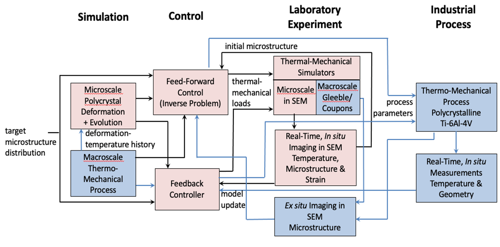
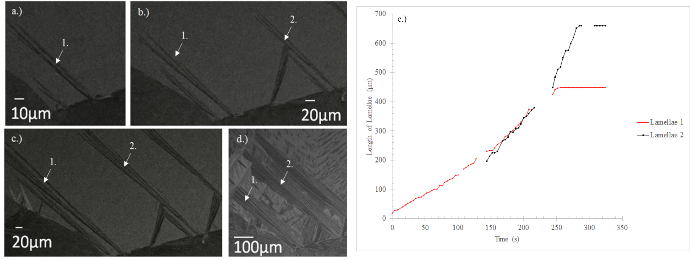
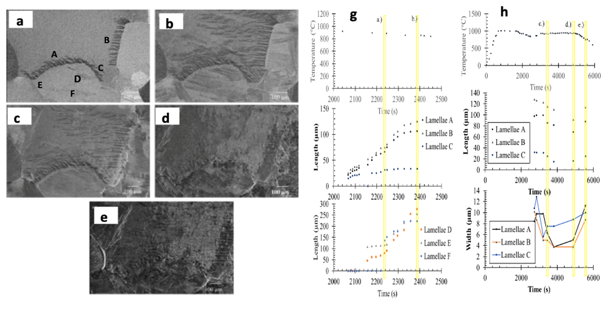
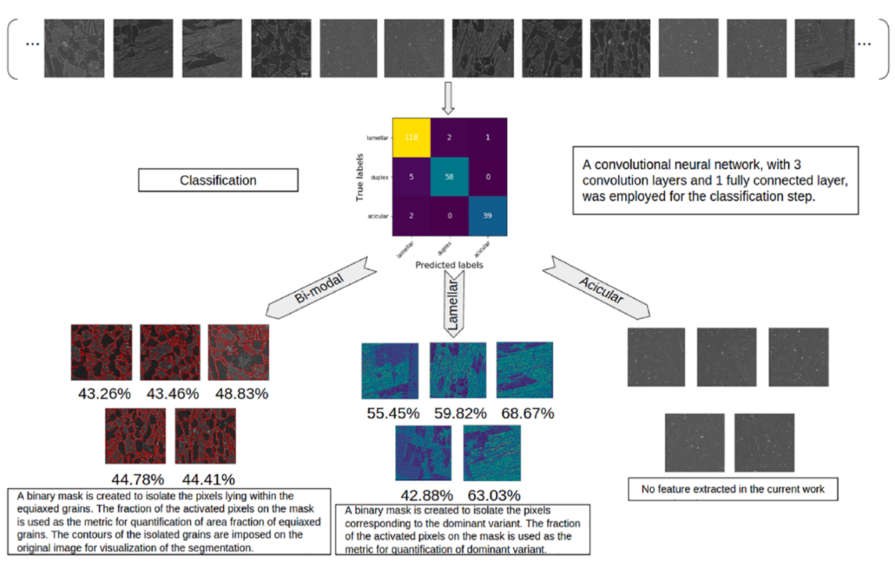
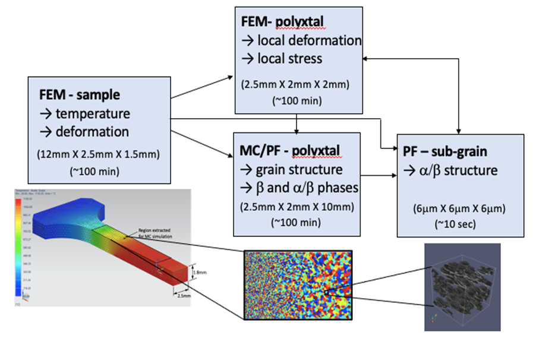
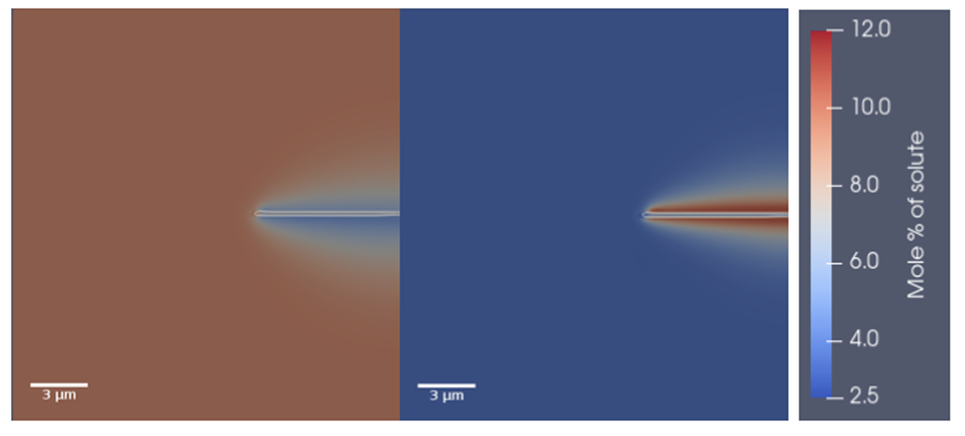
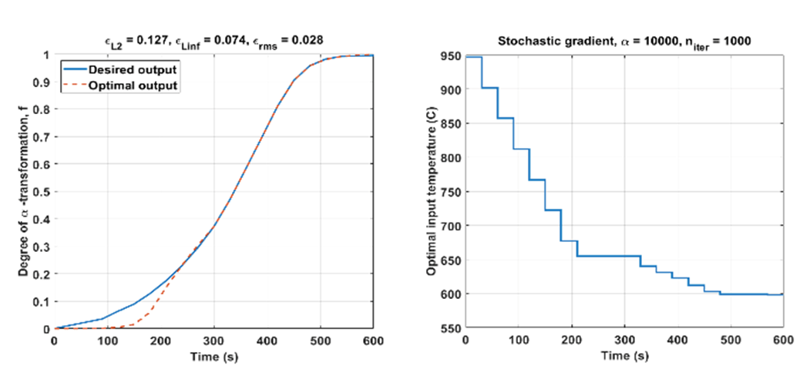

## Overview

Under this project we are establishing the methods, algorithms and architecture for integrated sensing-simulation-control methodologies for thermomechanical processing of an industrially relevant alloy, Ti-6Al-4V (Ti64), to attain as close as possible a desired microstructure. The overall strategy, illustrated in the figure below, starts with defining target microstructural features relative to an initial microstructure, then utilizing information from microstructure evolution simulations together with experimental observation in situ using an SEM heating-tensile stage (the “adaptive microscale simulator”, AMS) to inform a combined feed-forward/feedback thermomechanical trajectory control loop to evolve the material toward the target microstructure. We then apply this methodology to define thermomechanical processing trajectories for industrially relevant processing. The following major technical advances have been realized: real-time microstructure imaging in situ in an SEM under thermomechanical processing conditions; image-driven machine learning for automated microstructure characterization; a suite of high fidelity finite element, Monte Carlo, and phase field simulation tools that can be used on high performance computing platforms to model grain structure and phase evolution under thermomechanical processing conditions; fitting modeling and experimental observations to a reduced order single- and multi-phase Johnson-Mehl-Avrami-Kolmogorov (JMAK) equation and development of a process to find the optimal cooling profile for a prescribed $$\beta \rightarrow \alpha$$ transformation path to obtain as close as possible to a prescribed microstructure in Ti64.

## In situ Microstructure Evolution – Adaptive Microstructure Simulator (AMS)

As a core of this program, the AMS enables us to image the evolution of microstructure in Ti64 in real time in the SEM during thermomechanical processing conditions that are relevant to at least some industrial processing conditions.  A large set of experiments have been performed, in which the sample was heated above the $$\beta$$-transus, and then cooled to room temperature with or without load.  In the figure below, the sample is heated to above the $$\beta$$-transus, then held just below the transus at 980°C for 30 minutes, then cooled to room temperature at 0.1°C/s, such that the α-phase grows by a lamellar mechanism.  Lamellae start to be observable on cooling at around 880°C, and the times given in this subsequent description refer to a t=0 at this temperature, as the sample continues to cool at 0.1°C/s. (a) is recorded after 68 seconds, (b) after 148 s, (c) after 216 s and (d) after ~600 s (where the temperature is now around 820°C. (e) shows the projected (onto the sample surface plane) length evolution of two lamellae, demonstrating the ability to capture the evolution of the microstructure, not just at the integrated level, but also of its individual components.  We have demonstrated that in such observations we can identify conditions where the aspect ratios of the lamellae can be controlled with implication for the mechanical properties of the material.  This ability to track the individual components of the microstructure in addition to the evolution of the overall microstructure is key to understanding the 

In the figure below, we show results from lamellar growth during thermomechanical deformation.  The sample is annealed above the $$\beta$$-transus, held for 15 minutes at 1010°C, and then initially cooled at a rate of 0.5°C/s.  Once lamellae begin to nucleate, the sample is held at that temperature (~885°C, with thermal fluctuations of around 25°C) for 320 s until lamellar growth stagnates.  (a) and (b) show the growth of lamellae within different colonies during anneal, with (b) showing the microstructure once lamellar lengths stagnate after 320s. Deformation was then initiated at 930±20°C at a strain rate of 1x10-4 / s.  (c) and (d) show the microstructure after extension of  ~8 mm and 12 mm, respectively, corresponding to net strains of 33% and 50% across the gauge length. We observe shortening, even disappearance, of the lamella during the isothermal deformation process. When deformation is completed after an additional 2500s, cooling resumes at 0.5oC/s. As shown in (e), the lamellae restart growing in length.  (f) and (g) show the evolution of individual lamellae at each stage of this process.  These results again illustrate the power of the in situ SEM method, enabling us to track the evolution of the overall microstructure, and its individual components, as well as to separate the effects of temperature and deformation at each stage of the process. This enables the kinetics of the lamellar evolution to be understood in detail.

## Microstructure Image Analysis and Characterization

To control of microstructural evolution rapidly, we need objective methods to quantify structures.  The complexities of Ti64 microstructures as well as natural image-to-image variations make traditional image analysis difficult.  Therefore. a focus of this work was to develop Image Driven Machine Learning (IDML) methods for microstructure quantification.  We considered heat treatments that started above the $$\beta$$-transus and were subsequently quenched at different rates through furnace, air and water quenching, leading to microstructures that include lamellar, bimodal and acicular morphologies.   The IDML approach is shown in the Figure below. A testing set of the microstructures were assigned class labels, and subsequently, a convolution neural network (CNN) having three convolution layers and two pooling layers was trained to classify these images.  After classification, microstructure specific segmentation was completed using computer vision algorithms that included a topological watershed algorithm and the histogram of oriented gradients.  Segmentation successfully identified globular and lamellar regions of the images.  

## Modeling and Simulation of Microstructure Evolution
Predictive models of microstructure evolution for Ti64 under thermo-mechanical processing have been developed.  Figure 5 shows an overview of the simulation methods at the different length and time scales and how they are integrated. The finite element method (FEM) is used to model the thermomechanical response at the macroscale and the deformation response of the polycrystal and within grains due to the $$\beta\rightarrow\alpha$$ phase transformation, while a Monte Carlo (MC) method is used to model the thermally driven grain structure evolution. Phase field (PF) methods at the grain and sub-grain scale are used to model the formation of the $$\alpha/ \beta$$ sub-grain microstructure formed in Ti64 alloys.  

We have calibrated our MC simulation tool, which can handle temperature fields that vary in space and time, for grain growth in Ti64, and applied it to predict the observed grain size gradient in the AMS tensile sample.  At the macroscale, we did a thermal analysis of the tensile sample in the AMS stage, validating against a thermocouple temperature measurement on the surface. The resulting temperature field (Figure below, lower left) history was then applied in the MC simulation, starting with an initial average grain size of 20 $$\mu$$m, similar to that observed in the experiment.  The non-uniform grain size predicted from the simulation (Figure below, center bottom).   The crystal plasticity finite element (CPFE) developed in Maniatty’s group has also been extended to model the deformation behavior of the hcp $$\alpha$$ phase at typical forming temperatures and to model the bcc $$\beta$$ phase near the $$\beta$$-transus temperature deforming around nucleated $$\alpha$$ variants. Finally, we are coupling the CPFE and phase field (PF) frameworks described next.

A multi-component, multi-phase field model has been implemented to study the influence of continuous cooling on the solid-state phase transformation from $$\beta\rightarrow\alpha$$, occurring in Ti64. The PF model is comprised of twelve non-conserved order parameters, each of which uniquely describe an orientational variant of $$\alpha$$ in the $$\beta$$ metrix, and two conserved order parameters, each of which describe the composition fields. The model is coupled to thermodynamic databases, which facilitates a realistic solute partitioning between the phases in the simulations, considers the mechanical interaction between the $$\alpha$$ and $$\beta$$ phases and between different variants of $$\alpha$$, incorporates the experimentally observed habit-planes for each variant, and simulates nucleation of the $$\alpha$$ phase from the $$\beta$$ matrix by explicitly adding nuclei at a rate consistent with the classical nucleation theory. The free energy of nucleation is composed of both the chemical free energy difference between the two phases and the local elastic interaction energy.  The figure below shows $$\alpha$$-lamellar growth simulation fit to the in situ observations, which was done for different cooling conditions. The figure shows the distribution of Al (Left) and V (Right) solute fields around growing $$\alpha$$-lamellae. The effect of two distinct processing variables, cooling rate and prior-$$\beta$$ grain size, on the variant distribution was studied.

## Microstructure Control
The JMAK equation for phase transformations is being used to fit the $$\beta\rightarrow\alpha$$ phase transformation during cooling of Ti64. We have estimated the JMAK parameters, i.e., the rate constant and Avrami index, using Differential Scanning Calorimetry data via a nonlinear optimization scheme. The JMAK model with estimated parameters is used as the truth model in a trajectory optimization algorithm that seeks to identify optimal input temperature profiles required for generating a desired $$\alpha$$-transformation path, and the resulting outputs are compared with the reference paths, as shown in the Figure below.  Our method is based on iterative control, which estimates the trajectory gradient with respect to the temperature input for the gradient-based update of the cooling profile. In this last year of the program, we are extending the JMAK model based on the phase field predictions to consider the multi-component case and how thermo-mechanical processing condition affects the lamellar structure (e.g., width and length).  The parameter identification and processing optimization developed for temperature control so far may be applied to such a generalized JMAK model to achieve adaptive microstructure control.  We are testing these control algorithms first on the phase field model and then the AMS.

